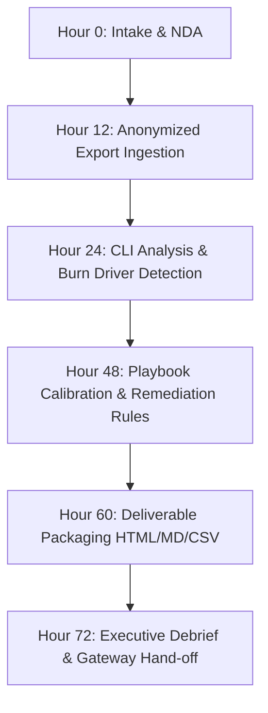

# TokenGoblin :: 72-Hour LLM Spend Audit Runbook

> **Target SLA:** 72 hours from client data receipt to executive debrief.  
> **Target Outcome:** 30%–50% verified LLM spend reduction with deterministic financial proof.  
> **Guarantee:** 3x audit fee in annualized savings or 100% money back.

---

## 1. Overview & Service Lifecycle

The TokenGoblin LLM Spend Audit is a fixed-fee ($1,500 Standard / $3,000 Enterprise) professional service designed for engineering leaders and FinOps teams burning significant capital on frontier AI models.



---

## 2. Phase 1: Intake & Data Sanitization (Hours 0–12)

### 2.1 Intake Form Trigger
When a client submits the intake form on `/audit`:
1. Confirmation is logged via `/api/contact`.
2. Send the client our secure intake email with the **Redacted Export Guide**.

### 2.2 Accepted Input Formats
The audit generator accepts:
- **OpenAI Organization Usage Export:** CSV or JSON export from the OpenAI usage dashboard.
- **Anthropic Console Export:** CSV export detailing per-workspace/per-key token consumption.
- **Custom Gateway / Proxy Logs:** CSV or JSONL containing `model`, `prompt_tokens`, `completion_tokens`, `cost`, `team`/`user`, and `feature`/`task`.

### 2.3 PII & Anonymization Guidelines
Instruct the client to sanitize payloads before transmission:
```bash
# Example client-side prompt redaction command for JSONL
jq 'del(.prompt, .messages, .response) | .prompt_excerpt = (.prompt_excerpt[0:20] // "")' raw_logs.jsonl > sanitized_audit.jsonl
```
*TokenGoblin only requires token counts, model names, timestamps, caller identifiers, and prompt length hashes.*

---

## 3. Phase 2: CLI Ingestion & Execution (Hours 12–24)

### 3.1 Running the Audit Generator CLI
Use the deterministic audit CLI binary (`cmd/audit`):

```bash
# Build the binary
go build -o ./bin/audit ./cmd/audit

# Run on the client's sanitized export
./bin/audit \
  --input ./data/client_export.csv \
  --out ./out/client_audit \
  --tenant "Client Organization" \
  --format auto
```

### 3.2 Generated Artifacts
The CLI writes 3 core deliverables to `--out`:
1. `audit_report.html` — Self-contained dark-mode dashboard with charts, KPI cards, and breakdown tables.
2. `audit_report.md` — Markdown document for Notion, GitHub, and Slack summaries.
3. `breakdown.csv` — Comprehensive tabular spreadsheet for client finance/FinOps analysts.

---

## 4. Phase 3: Analytical Calibration (Hours 24–48)

Review the generated findings and calibrate the 4 savings playbooks:

### 4.1 Playbook Calibration Matrix

| Playbook | What to Inspect in Data | Implementation Action |
|---|---|---|
| **1. 70/20/10 Model Routing** | Look for high % of spend on `o1`, `gpt-4o`, `claude-3-5-sonnet` with routine tasks (e.g. classification, formatting, basic SQL). | Configure TokenGoblin router: route 70% routine traffic to `gpt-4o-mini`, `gemini-2.0-flash`, or `claude-3-5-haiku`. |
| **2. Prompt Prefix Caching** | Inspect `cached_tokens` vs `prompt_tokens`. If cached ratio is < 20%, prompt caching is underutilized. | Standardize system prompt templates to keep static tokens in prefix headers. |
| **3. Model Right-Sizing** | Inspect prompt graveyard and failure rates in reasoning models. | Downgrade over-provisioned models to fine-tuned or smaller distilled equivalents. |
| **4. Output Length Controls** | Inspect completion token volume and cost ratio. Completion tokens cost 3x-4x prompt tokens. | Apply stop sequences, set strict `max_completion_tokens`, and strip conversational pleasantries. |

---

## 5. Phase 4: Executive Presentation Packaging (Hours 48–60)

Prepare the **Executive Debrief Deck** (10-15 slides):

### Slide Outline
1. **Title:** LLM Spend Audit & Optimization Roadmap (Client Name)
2. **Executive Summary:** Baseline Spend ($X), Projected Savings ($Y / Z%), Post-Optimization Spend ($W).
3. **Primary Burn Drivers:** The 3-5 operational sources causing 80% of waste.
4. **Model Portfolio Breakdown:** Spend concentration by provider and tier.
5. **Department & Team Attribution:** Who is spending what and why.
6. **Playbook 1: 70/20/10 Intelligent Routing:** Architecture diagram & financial delta.
7. **Playbook 2: Prompt Prefix Caching:** Cache activation roadmap & savings.
8. **Playbook 3: Model Right-Sizing:** Evaluating tasks suitable for mini/flash models.
9. **Playbook 4: Output Guardrails:** Trimming runaway completions and stop sequences.
10. **30-Day Implementation Roadmap:** Week 1-4 deployment schedule.
11. **Guarantee Reaffirmation:** 3x ROI confirmation ($4,500 / $9,000 threshold).

---

## 6. Phase 5: Debrief & Implementation Hand-off (Hours 60–72)

### 6.1 Conduct the Executive Call (45m / 90m)
- **Attendees:** VP Engineering, Lead Architect, FinOps / Finance lead.
- **Agenda:**
  - 10 min: Executive overview and total potential savings.
  - 20 min: Deep dive into the 4 savings playbooks.
  - 10 min: Review of immediate drop-in TokenGoblin proxy configurations.
  - 5 min: Q&A and scheduling follow-up checkpoint.

### 6.2 Deliverable Package Checklist
- [ ] `audit_report.html` (interactive executive dashboard)
- [ ] `audit_report.md` (shared in client Slack/Teams)
- [ ] `breakdown.csv` (provided for financial modeling)
- [ ] Slide deck PDF
- [ ] Sample TokenGoblin proxy middleware configuration snippet
